```mermaid
classDiagram
    direction TB

    %% ==========================================
    %% DOMÍNIO: JOGADOR & PARTIDA
    %% ==========================================
    class Jogador {
        -String id
        -String nickname
        -int pontos
        +adicionarPontos(int quantidade) void
        +removerPontos(int quantidade) void
        +getId() String
        +getPontos() int
    }

    class Partida {
        -String id
        -List~Jogador~ jogadores
        -StatusPartidaState estadoAtual
        -ResultadoPartida resultado
        -DateTime dataCriacao
        +iniciar() void
        +encerrar(ResultadoPartida resultado) void
        +cancelar(String motivo) void
        +setEstado(StatusPartidaState novoEstado) void
        +getJogadores() List~Jogador~
        +getEstado() StatusPartidaState
    }

    class ResultadoPartida {
        -String idVencedor
        -String idPerdedor
        -String resumo
        +getIdVencedor() String
        +getIdPerdedor() String
        +getResumo() String
    }

    %% ==========================================
    %% STATE PATTERN (Ciclo de Vida da Partida)
    %% ==========================================
    class StatusPartidaState {
        <<interface>>
        +iniciar(Partida partida) void
        +encerrar(Partida partida, ResultadoPartida res) void
        +cancelar(Partida partida, String motivo) void
        +getNomeStatus() String
    }

    class AguardandoJogadoresState {
        +iniciar(Partida partida) void
        +encerrar(Partida partida, ResultadoPartida res) void
        +cancelar(Partida partida, String motivo) void
        +getNomeStatus() String
    }

    class EmAndamentoState {
        +iniciar(Partida partida) void
        +encerrar(Partida partida, ResultadoPartida res) void
        +cancelar(Partida partida, String motivo) void
        +getNomeStatus() String
    }

    class FinalizadaState {
        +iniciar(Partida partida) void
        +encerrar(Partida partida, ResultadoPartida res) void
        +cancelar(Partida partida, String motivo) void
        +getNomeStatus() String
    }

    class CanceladaState {
        +iniciar(Partida partida) void
        +encerrar(Partida partida, ResultadoPartida res) void
        +cancelar(Partida partida, String motivo) void
        +getNomeStatus() String
    }

    StatusPartidaState <|.. AguardandoJogadoresState : implements
    StatusPartidaState <|.. EmAndamentoState : implements
    StatusPartidaState <|.. FinalizadaState : implements
    StatusPartidaState <|.. CanceladaState : implements
    Partida *-- StatusPartidaState : context
    Partida o-- Jogador : agrega
    Partida *-- ResultadoPartida : compõe

    %% ==========================================
    %% STRATEGY PATTERN (Matchmaking - OCP)
    %% ==========================================
    class IMatchmakingStrategy {
        <<interface>>
        +formarGrupo(List~Jogador~ fila) List~Jogador~
    }

    class Duelo1v1Strategy {
        +formarGrupo(List~Jogador~ fila) List~Jogador~
    }
    IMatchmakingStrategy <|.. Duelo1v1Strategy : implements

    %% ==========================================
    %% SERVIÇOS & CASOS DE USO (SRP)
    %% ==========================================
    class MatchmakingService {
        -List~Jogador~ filaEspera
        -IMatchmakingStrategy strategy
        -PartidaService partidaService
        +adicionarNaFila(Jogador jogador) void
        +removerDaFila(String jogadorId) void
        +processarFila() void
    }

    class PartidaService {
        -IPartidaRepository partidaRepo
        -IJogadorRepository jogadorRepo
        -IBatalhaGateway batalhaGateway
        +criarPartida(List~Jogador~ jogadores) Partida
        +iniciarPartida(String partidaId) void
        +processarResultadoBatalha(ResultadoBatalhaDTO dto) void
        +cancelarPartida(String partidaId, String motivo) void
    }

    class ConsultaPartidaService {
        -IPartidaRepository partidaRepo
        +buscarPorId(String partidaId) Partida
        +listarPorJogador(String jogadorId) List~Partida~
        +listarPorStatus(String status) List~Partida~
    }

    MatchmakingService o-- IMatchmakingStrategy : usa
    MatchmakingService --> PartidaService : aciona criacao
    PartidaService --> Partida : manipula

    %% ==========================================
    %% CONTRATOS & INTEGRAÇÕES EXTERNAS (DIP, ISP, Demeter)
    %% ==========================================
    class IPartidaRepository {
        <<interface>>
        +salvar(Partida partida) void
        +buscarPorId(String id) Partida
        +buscarPorJogador(String jogadorId) List~Partida~
    }

    class IJogadorRepository {
        <<interface>>
        +buscarPorId(String id) Jogador
        +atualizar(Jogador jogador) void
    }

    class IBatalhaGateway {
        <<interface>>
        +enviarParaBatalha(RequisicaoBatalhaDTO dados) void
    }

    class IBatalhaCallbackHandler {
        <<interface>>
        +onBatalhaFinalizada(ResultadoBatalhaDTO resultado) void
    }

    class ResultadoBatalhaDTO {
        +String idPartida
        +String idVencedor
        +String idPerdedor
        +String resumo
    }

    class RequisicaoBatalhaDTO {
        +String idPartida
        +List~String~ jogadoresIds
    }

    PartidaService ..> IPartidaRepository : depende de (DIP)
    PartidaService ..> IJogadorRepository : depende de (DIP)
    PartidaService ..> IBatalhaGateway : depende de (DIP)
    PartidaService ..|> IBatalhaCallbackHandler : implementa (ISP)
    PartidaService ..> ResultadoBatalhaDTO : consome
    PartidaService ..> RequisicaoBatalhaDTO : produz
    ConsultaPartidaService ..> IPartidaRepository : depende de (DIP)
```

## 2. Decisões Arquiteturais e Padrões Aplicados

* **SRP (Single Responsibility Principle):** A antiga classe centralizada foi decomposta em serviços específicos: `MatchmakingService` (gerenciamento de fila), `PartidaService` (orquestração do ciclo de vida), `ConsultaPartidaService` (consultas/histórico) e gateways de integração.
* **State Pattern & Transições Válidas:** O ciclo de vida da partida é controlado por `StatusPartidaState`. Operações como `cancelar()` ou `encerrar()` são delegadas para o estado atual (`AguardandoJogadores`, `EmAndamento`, `Finalizada`, `Cancelada`), prevenindo chamadas inválidas (como cancelar partida já finalizada).
* **OCP (Open/Closed Principle):** A seleção de oponentes foi desacoplada via `IMatchmakingStrategy`, permitindo introduzir novos critérios de pareamento sem modificar o serviço.
* **DIP & ISP:** Dependências de infraestrutura e persistência são invertidas através de interfaces (`IPartidaRepository`, `IJogadorRepository`, `IBatalhaGateway`). A comunicação com a aplicação de Batalha ocorre por interfaces segregadas (`IBatalhaGateway` e `IBatalhaCallbackHandler`).
* **Lei de Demeter:** A integração recebe dados planos via `ResultadoBatalhaDTO`. O cálculo e atribuição de pontos são feitos diretamente através dos métodos de domínio da entidade `Jogador`, sem encadeamento de métodos internos de terceiros.
