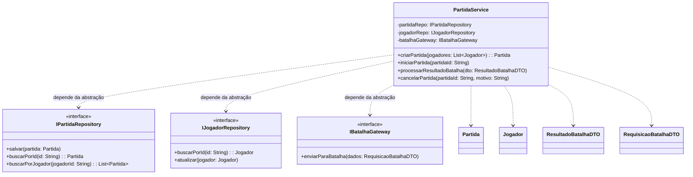
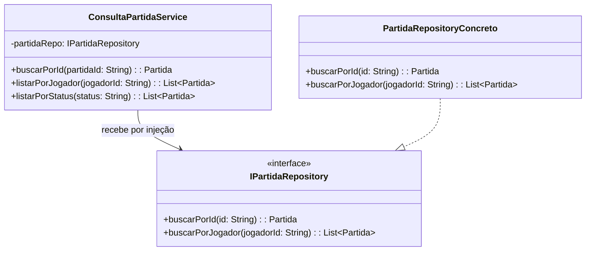

# Princípio da Inversão de Dependência (DIP)

O **Dependency Inversion Principle (DIP)** afirma que:

1. módulos de alto nível não devem depender diretamente de módulos de baixo
   nível; ambos devem depender de abstrações;
2. abstrações não devem depender de detalhes; detalhes devem depender de
   abstrações.

No modelo atualizado, `PartidaService` contém a orquestração dos casos de uso,
enquanto persistência e comunicação externa são acessadas por interfaces.

## Dependências do `PartidaService`

O serviço não precisa saber se as interfaces são implementadas por banco
relacional, armazenamento em memória ou um mock. Também não precisa conhecer
como o gateway conversa com o sistema externo de batalhas.

## Consulta de partidas

O mesmo princípio aparece em `ConsultaPartidaService`:

`PartidaRepositoryConcreto` representa um adaptador de infraestrutura, não uma
dependência que o serviço deve criar diretamente. Em produção pode acessar um
banco; nos testes, pode ser substituído por uma implementação em memória.

## Relação com o diagrama inicial

No diagrama inicial, `GestaoPartidas` se comunicava diretamente com
`SistemaBatalhas` e administrava as coleções de partidas e jogadores. No
modelo atualizado, os casos de uso dependem de contratos (`IPartidaRepository`,
`IJogadorRepository` e `IBatalhaGateway`), mantendo os detalhes externos fora
da regra de negócio.

## Benefícios

O DIP facilita testes unitários, permite trocar tecnologias de persistência e
integração e protege as regras de negócio contra detalhes externos. Ele também
torna explícito, no diagrama, quais contratos cada serviço realmente precisa.
