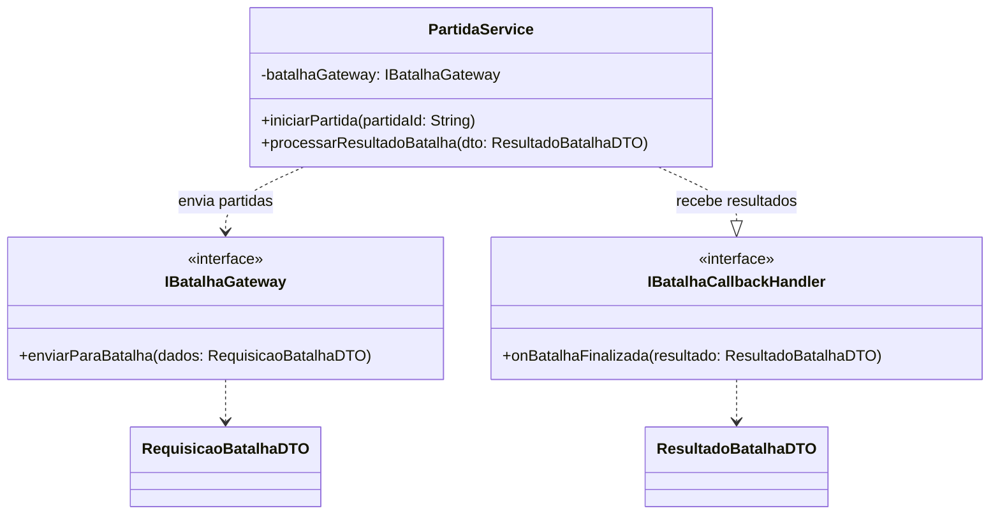
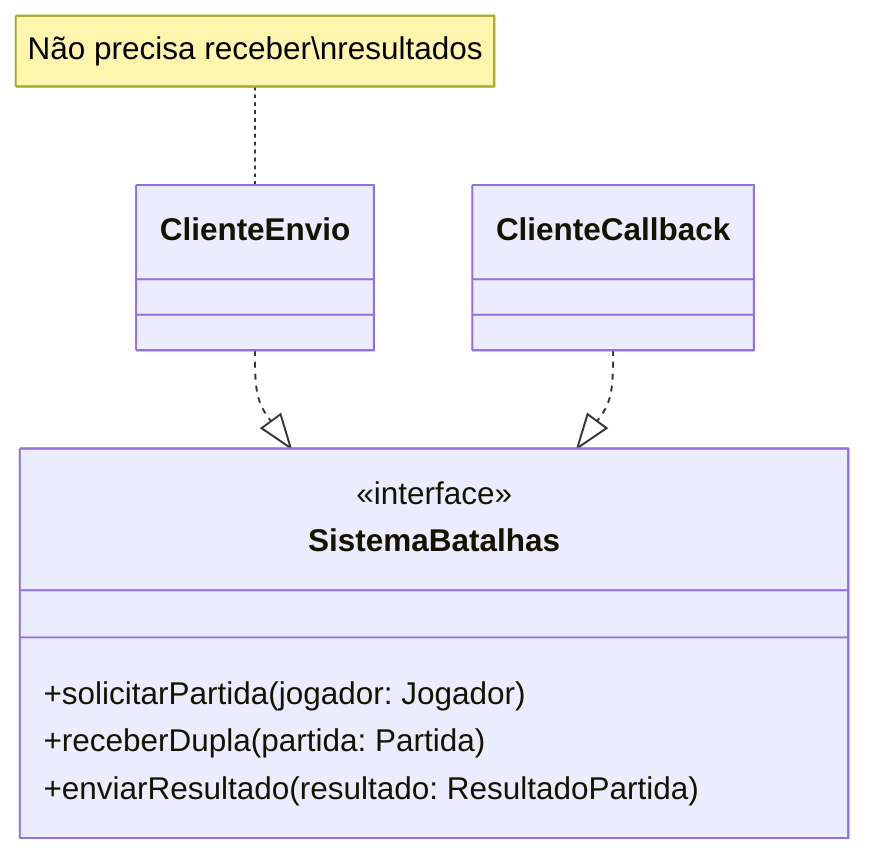

# Princípio da Segregação de Interfaces (ISP)

O **Interface Segregation Principle (ISP)** afirma que uma classe não deve ser
obrigada a depender de métodos que não utiliza. No modelo atualizado, a
integração com o sistema externo de batalhas foi dividida em dois contratos
específicos.

## Interfaces do modelo atualizado

Os contratos representam responsabilidades diferentes:

- `IBatalhaGateway` define somente o envio de uma partida para o sistema de
  batalhas;
- `IBatalhaCallbackHandler` define somente o recebimento do resultado;
- `RequisicaoBatalhaDTO` e `ResultadoBatalhaDTO` transportam dados específicos
  de cada direção.

Uma implementação que apenas envia partidas não precisa implementar o método de
callback. Da mesma forma, um componente que recebe resultados não precisa
conhecer a operação de envio.

## Comparação com o diagrama inicial

No modelo inicial, `GestaoPartidas` dependia diretamente de `SistemaBatalhas`,
que concentrava operações como solicitar partida, receber dupla e enviar
resultado. No modelo atualizado, essas capacidades foram representadas por
interfaces menores e DTOs explícitos.

Essa separação evita um contrato genérico como:

No contrato antigo, `ClienteEnvio` e `ClienteCallback` seriam obrigados a
depender de métodos que não utilizam. As interfaces segregadas eliminam esse
acoplamento.

## Benefícios

O ISP deixa a integração mais clara, facilita criar mocks para os testes de
`PartidaService` e permite alterar o envio sem afetar o processamento de
resultados.
