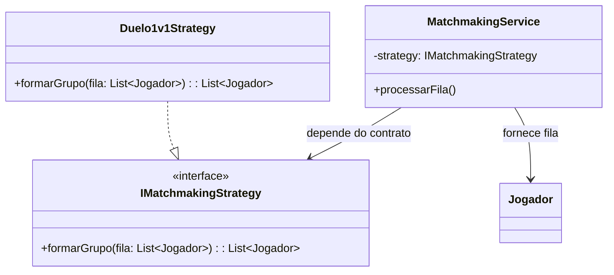
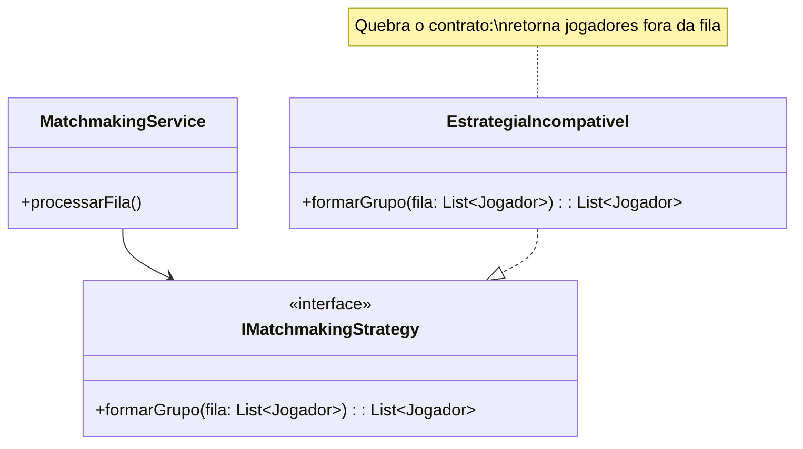

# Princípio da Substituição de Liskov (LSP)

O **Liskov Substitution Principle (LSP)** afirma que uma implementação deve
poder substituir a abstração que implementa sem quebrar o código cliente. No
modelo atualizado, esse princípio aparece claramente no contrato
`IMatchmakingStrategy`.

## Aplicação nas estratégias de matchmaking

`MatchmakingService` não precisa saber se o grupo foi formado por uma regra de
duelo, por ranking ou por outro critério. Qualquer implementação válida deve:

- receber uma fila de jogadores;
- retornar um grupo de jogadores que pertença à fila;
- respeitar as regras mínimas esperadas pelo serviço;
- não alterar o contrato nem exigir parâmetros adicionais.

Assim, `Duelo1v1Strategy` pode substituir `IMatchmakingStrategy` sem exigir
mudanças no serviço.

## Exemplo de violação

Uma estratégia incompatível poderia retornar jogadores que não estavam na fila,
retornar `null` quando há jogadores suficientes ou exigir que a fila já esteja
ordenada por um campo que o contrato não menciona. Nesse caso, o serviço teria
de conhecer detalhes de cada implementação:

O problema não é a estratégia usar uma regra diferente. O problema é violar as
garantias que `MatchmakingService` espera da interface.

## Relação com o State Pattern

O mesmo cuidado vale para `StatusPartidaState` e seus estados
`AguardandoJogadoresState`, `EmAndamentoState`, `FinalizadaState` e
`CanceladaState`. Cada implementação deve respeitar o contrato de transição
da partida e preservar seus invariantes, como não produzir um resultado antes
do encerramento válido.

## Benefícios

O LSP permite trocar estratégias e estados sem espalhar verificações
específicas pelo sistema. O código cliente trabalha com abstrações e confia em
comportamentos compatíveis.
