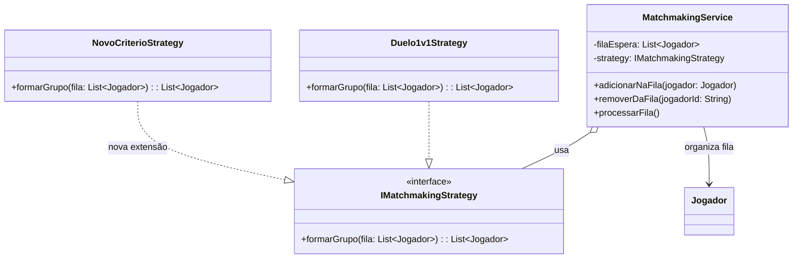

# Princípio Aberto/Fechado (OCP)

O **Open/Closed Principle (OCP)** afirma que os módulos devem estar abertos
para extensão, mas fechados para modificação. No modelo atualizado, a
formação de grupos foi isolada atrás da interface `IMatchmakingStrategy`.

## Aplicação no matchmaking

`Duelo1v1Strategy` representa a implementação existente no modelo. Para
adicionar um novo critério, como formar times equilibrados por pontuação, uma
nova estratégia pode implementar `IMatchmakingStrategy`. O
`MatchmakingService` continua chamando apenas `formarGrupo`, sem precisar
conhecer a regra concreta.

## Comparação com o modelo inicial

No diagrama inicial, `GestaoPartidas` controlava diretamente a solicitação de
partidas e a seleção de jogadores. A inclusão de outra forma de pareamento
exigiria modificar essa classe.

No modelo atualizado, o comportamento variável está em estratégias
substituíveis:

1. `MatchmakingService` mantém a fila;
2. `IMatchmakingStrategy` define o contrato;
3. `Duelo1v1Strategy` implementa o pareamento atual;
4. novas estratégias são adicionadas sem alterar o serviço.

## Cuidados

O OCP não significa que nenhum código possa ser alterado. A abstração deve
representar uma variação real do domínio; criar estratégias para toda
possibilidade aumenta a complexidade sem benefício.

## Benefícios

Novos critérios de matchmaking ficam isolados, são testados separadamente e
reduzem o risco de regressão no fluxo de `MatchmakingService`.
