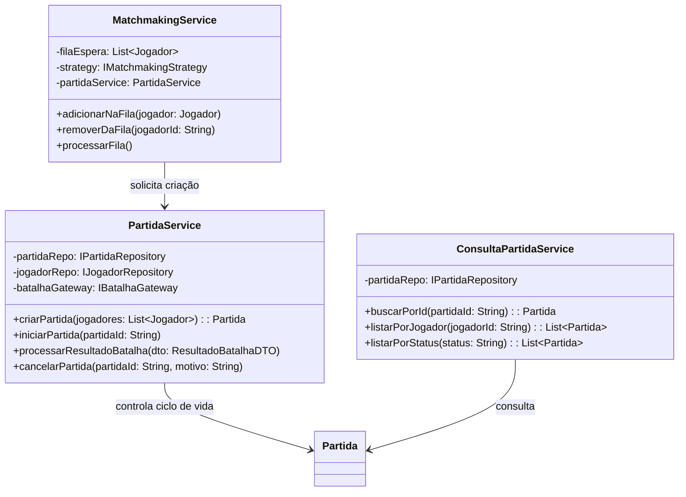

# Princípio da Responsabilidade Única (SRP)

O **Single Responsibility Principle (SRP)** afirma que uma classe deve ter
apenas um motivo para mudar. No modelo atualizado, a antiga classe central
`GestaoPartidas`, presente no diagrama inicial, foi dividida em serviços com
responsabilidades específicas.

## Aplicação no modelo atualizado

Cada serviço tem um motivo diferente para mudar:

- `MatchmakingService` muda quando as regras de fila ou formação de grupos
  mudam;
- `PartidaService` muda quando mudam as operações do ciclo de vida da partida
  ou o processamento do resultado da batalha;
- `ConsultaPartidaService` muda quando mudam os filtros e consultas do
  histórico.

`Partida` permanece como entidade de domínio, responsável por seu próprio
estado (`iniciar`, `encerrar` e `cancelar`). Ela não precisa conhecer como uma
partida é localizada, como jogadores entram na fila ou como o resultado é
enviado para o sistema de batalhas.

## Relação com o diagrama inicial

No diagrama inicial, `GestaoPartidas` acumulava operações como solicitar
partida, consultar jogadores, enviar uma partida ao sistema externo,
registrar resultado e consultar histórico. Isso criava vários motivos para a
classe mudar.

No modelo atualizado, essas responsabilidades são distribuídas entre
`MatchmakingService`, `PartidaService` e `ConsultaPartidaService`. Os
repositórios e o gateway também isolam persistência e integração externa.

## Benefícios

Essa divisão torna os testes mais focados e permite alterar a formação de
grupos sem modificar as consultas ou o ciclo de vida da partida. Também
facilita localizar o componente responsável por cada caso de uso.
